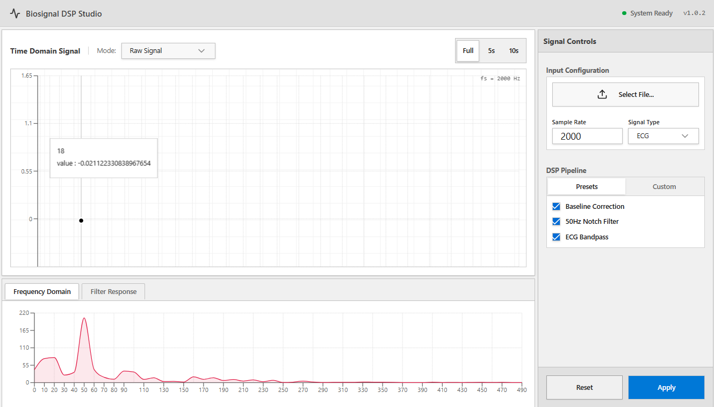

A lightweight DSP workstation for biomedical signal analysis.
# Biosignal DSP Studio


A lightweight **DSP workstation for biomedical signal analysis** built with Python and PyQt.

Biosignal DSP Studio provides an interactive environment for:

- Loading physiological signal recordings
- Applying digital signal processing pipelines
- Visualizing signals in **time and frequency domains**
- Inspecting filter responses
- Extracting basic physiological metrics such as **heart rate**

The project focuses on understanding and applying **classical DSP techniques** to real biomedical signals like ECG.

---

#  Features


## 📂 Signal Loading

- Load biosignal recordings from `.txt` files
- Select specific **channels** from multi-column recordings
- Load **time-windowed segments** of signals
- Configurable **sampling rate**

---

## ⚙️ Digital Signal Processing Pipeline

The system allows building configurable DSP chains.

### Butterworth Filters

- Low-pass filtering
- High-pass filtering
- Band-pass filtering

Common biomedical applications:

- Baseline drift removal
- Noise suppression
- Band-limited physiological signals

---

### 🔌 Notch Filter

Removes power-line interference.

Typical use:

- **50 Hz** powerline noise removal
- **60 Hz** powerline noise removal (US)

---

## 📈 Signal Visualization

### Time Domain Viewer

Displays:

- Raw signal
- Filtered signal
- Detected peaks (ECG R-peaks)

Features:

- Time axis in seconds
- Grid visualization
- Interactive zooming (PyQtGraph)

---

### Frequency Domain Analysis

Displays **FFT spectrum** of:

- Raw signal
- Filtered signal

Helps visualize:

- Noise components
- Filter effectiveness
- Signal bandwidth

---

### Filter Response Visualization

Displays the **combined frequency response** of the filter pipeline.

This helps understand how the DSP chain shapes the signal.

---

## ❤️ ECG Feature Extraction

Currently implemented:

- **R-peak detection**
- **Heart rate estimation**

These allow extraction of basic physiological metrics directly from the signal.

---

# 🏗️ System Architecture

```
┌─────────────┐
│  Signal File│
│  (TXT/CSV)  │
└──────┬──────┘
       │
       ▼
┌─────────────┐
│   Loader    │
│ data.loader │
└──────┬──────┘
       │
       ▼
┌─────────────┐
│ Signal Model│
│ Raw Signal  │
└──────┬──────┘
       │
       ▼
┌─────────────┐
│ FilterChain │
│ DSP Filters │
└──────┬──────┘
       │
       ▼
┌─────────────┐
│ Feature     │
│ Extraction  │
│ (ECG Peaks) │
└──────┬──────┘
       │
       ▼
┌─────────────┐
│ Visualization│
│ PyQtGraph UI │
└─────────────┘
```

---

# ⚙️ DSP Pipeline

```
Raw Biosignal
     │
     ▼
Highpass Filter (0.5 Hz)
Baseline Wander Removal
     │
     ▼
Notch Filter (50 Hz)
Powerline Noise Removal
     │
     ▼
Lowpass Filter (40 Hz)
High Frequency Noise Removal
     │
     ▼
Filtered Signal
     │
     ▼
R-Peak Detection
     │
     ▼
Heart Rate Estimation
```

---

# 🖥️ Application Interface

The interface is divided into three main areas.

### Signal Viewer

Displays:

- Raw waveform
- Filtered waveform
- Detected heartbeats

---

### Analysis Tabs

- **Frequency Domain**
- **Filter Response**

---

### Control Panel

Allows configuration of:

- Signal loading
- Sampling rate
- DSP filters
- Pipeline application and reset

---

# 📸 Screenshots

### Signal Viewer



---

### Analysis Panels


---

# 🚀 Installation

## 1. Clone the repository

```bash
git clone https://github.com/yourusername/biosignal-dsp-studio.git
cd biosignal-dsp-studio
```

---

## 2. Create a virtual environment

```bash
python -m venv venv
```

Activate it.

Linux / macOS:

```bash
source venv/bin/activate
```

Windows:

```bash
venv\Scripts\activate
```

---

## 3. Install dependencies

```bash
pip install -r requirements.txt
```

Required packages include:

- numpy
- scipy
- matplotlib
- pyqt5
- pyqtgraph

---

# ▶️ Running the Application

Start the application:

```bash
python main.py
```

Workflow:

1. Click **Load Signal**
2. Select a biosignal file
3. Configure DSP parameters
4. Apply the pipeline

The application will display:

- Time-domain waveform
- FFT spectrum
- Filter response
- Detected ECG peaks

---

# 🗂️ Project Structure

```
biosignal-dsp-studio
│
├── assets
│   ├── ss1.png
│   └── ss2.png
│
├── data
│   └── loader.py
│
├── dsp
│   ├── filters
│   │   ├── butterworth.py
│   │   └── notch.py
│   │
│   ├── transforms
│   │   └── fft.py
│   │
│   └── features
│       └── ecg.py
│
├── ui
│   └── main_window.py
│
├── tests
│
├── main.py
└── README.md
```

---

# 📌 Current Status

Implemented:

- Signal loading
- Time window extraction
- Configurable DSP pipeline
- Time-domain visualization
- FFT analysis
- Filter response visualization
- ECG R-peak detection
- Heart rate estimation
- Interactive PyQt interface

---

# 🔭 Future Improvements

Planned enhancements:

- Multiple filter chains
- ECG preprocessing presets
- Signal navigation slider
- EEG / EMG processing modules
- Heart rate variability (HRV) metrics
- Export filtered signals
- Real-time signal streaming

---

# 🎯 Purpose

This project serves as a **learning and experimentation platform** for:

- Digital signal processing
- Biomedical signal analysis
- Scientific visualization
- Interactive signal exploration

It combines **DSP, UI development, and biomedical signal processing** into a modular toolkit.

---
