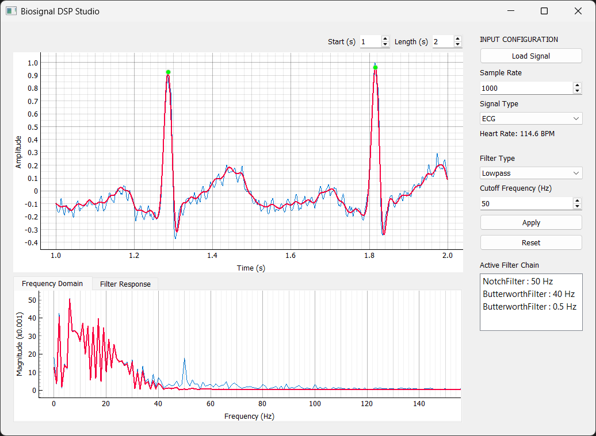
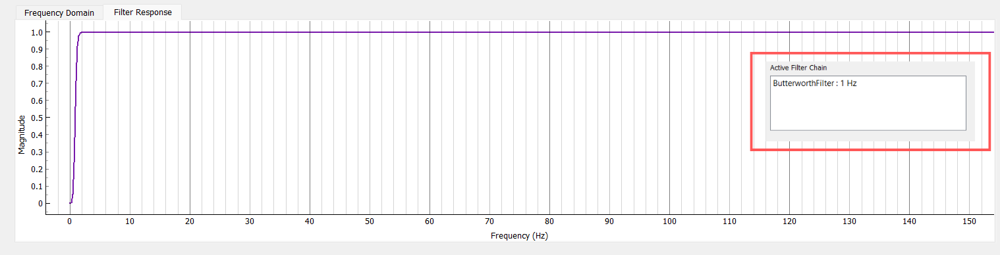
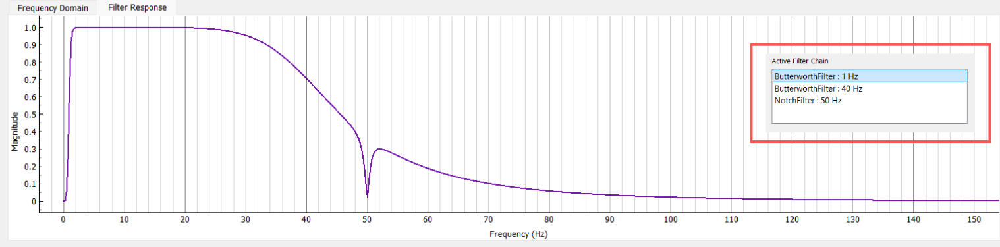
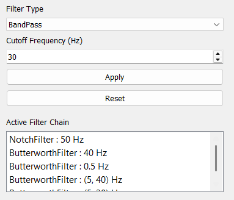
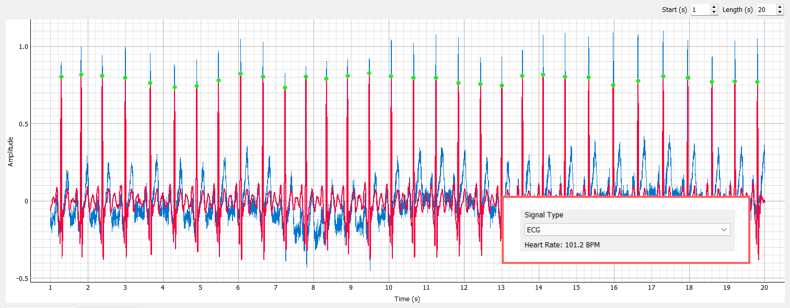
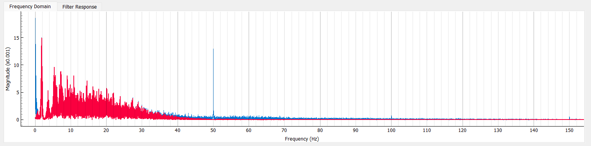

# Biosignal DSP Studio

A lightweight **DSP workstation for biomedical signal analysis** built with Python and PyQt.


Biosignal DSP Studio provides an interactive environment for:

- Loading physiological signal recordings  
- Building configurable **DSP pipelines**  
- Visualizing signals in **time and frequency domains**  
- Inspecting **filter responses**  
- Extracting physiological metrics such as **heart rate**

The goal of the project is to explore and apply **classical digital signal processing techniques** to real biomedical signals such as ECG and EMG.

---

# Screenshots

### Full Application Interface



The default workspace showing the signal viewer, DSP controls, and analysis panels.  
Users can load signals, configure filter chains, and inspect results within a single interface.

---

### Frequency Spectrum Analysis



FFT visualization of the raw biosignal, showing the spectral distribution of the signal before filtering.

---

### Filtered Frequency Response



Frequency-domain view after applying filters in the DSP pipeline.  
This allows inspection of how the filter chain suppresses noise and isolates relevant signal bands.

---

### Filter Pipeline Visualization



Visualization of the **sequential filter stack** applied to the signal.  
Each stage modifies the signal before passing it to the next stage, allowing compound filtering strategies such as baseline removal followed by noise suppression.

---

### Heart Rate Detection



ECG waveform with detected **R-peaks** highlighted across a 20-second segment.  
Heart rate is computed from RR intervals, forming the basis for future **Heart Rate Variability (HRV)** analysis.

---

### Analysis Panels



Frequency-domain analysis and filter response visualization for the active DSP pipeline.

---

# Features

## Signal Loading

- Load biosignal recordings from `.txt` files
- Select **channels** from multi-column recordings
- Load specific **time windows** of signals
- Configure **sampling rate**

---

## Digital Signal Processing Pipeline

The application allows users to construct configurable DSP chains.

### Butterworth Filters

Available filters:

- Low-pass
- High-pass
- Band-pass

Applications include:

- Baseline drift removal  
- Noise suppression  
- Physiological signal isolation  

---

### Notch Filter

Used to remove power-line interference.

Typical configurations:

- **50 Hz** powerline removal  
- **60 Hz** powerline removal  

---

## Signal Visualization

### Time Domain Viewer

Displays:

- Raw signal  
- Filtered signal  
- Detected ECG R-peaks  

Features:

- Time axis in seconds  
- Grid visualization  
- Interactive zooming via **PyQtGraph**

---

### Frequency Domain Analysis

Displays the **FFT spectrum** of:

- Raw signal  
- Filtered signal  

Useful for observing:

- Noise components  
- Signal bandwidth  
- Filter effectiveness  

---

### Filter Response Visualization

Displays the **combined frequency response** of the entire filter chain.

This helps understand how the DSP pipeline shapes the signal.

---

## ECG Feature Extraction

Currently implemented:

- **R-peak detection**
- **Heart rate estimation**

Heart rate is calculated from **RR intervals** between detected peaks.

Future updates will include **Heart Rate Variability (HRV) analysis**.

---

# System Architecture

```
Signal File (TXT / CSV)
        │
        ▼
   Data Loader
        │
        ▼
   Signal Model
     (Raw Data)
        │
        ▼
   Filter Pipeline
   (DSP Filters)
        │
        ▼
   Feature Extraction
   (ECG Peaks)
        │
        ▼
   Visualization Layer
   (PyQtGraph UI)
```

---

# DSP Processing Pipeline

```
Raw Biosignal
     │
     ▼
Highpass Filter (0.5 Hz)
Baseline Wander Removal
     │
     ▼
Notch Filter (50 Hz)
Powerline Noise Removal
     │
     ▼
Lowpass Filter (40 Hz)
High Frequency Noise Removal
     │
     ▼
Filtered Signal
     │
     ▼
R-Peak Detection
     │
     ▼
Heart Rate Estimation
```

---

# Application Interface

The application interface consists of three main areas.

### Signal Viewer

Displays:

- Raw waveform  
- Filtered waveform  
- Detected heartbeats  

### Analysis Tabs

Includes:

- **Frequency Domain Analysis**
- **Filter Response Visualization**

### Control Panel

Allows configuration of:

- Signal loading  
- Sampling rate  
- DSP filters  
- Pipeline application and reset  

---

# Installation

## Clone the repository

```bash
git clone https://github.com/yourusername/biosignal-dsp-studio.git
cd biosignal-dsp-studio
```

---

## Create a virtual environment

```bash
python -m venv venv
```

Activate it.

Linux / macOS:

```bash
source venv/bin/activate
```

Windows:

```bash
venv\Scripts\activate
```

---

## Install dependencies

```bash
pip install -r requirements.txt
```

Required packages include:

- numpy
- scipy
- matplotlib
- pyqt5
- pyqtgraph

---

# Running the Application

Start the application:

```bash
python main.py
```

Typical workflow:

1. Load a biosignal file  
2. Configure DSP filters  
3. Apply the filter pipeline  
4. Inspect the signal in time and frequency domains  
5. Observe detected ECG peaks and estimated heart rate  

---

# Project Structure

```
biosignal-dsp-studio
│
├── assets
│   ├── ss1.png
│   └── ss2.png
│
├── data
│   └── loader.py
│
├── dsp
│   ├── filters
│   │   ├── butterworth.py
│   │   └── notch.py
│   │
│   ├── transforms
│   │   └── fft.py
│   │
│   └── features
│       └── ecg.py
│
├── ui
│   └── main_window.py
│
├── tests
│
├── main.py
└── README.md
```

---

# Current Status

Implemented features:

- Signal loading  
- Time window extraction  
- Configurable DSP pipeline  
- Time-domain visualization  
- FFT spectrum analysis  
- Filter response visualization  
- ECG R-peak detection  
- Heart rate estimation  
- Interactive PyQt interface  

---

# Future Improvements

Planned enhancements:

- Multiple filter chains  
- ECG preprocessing presets  
- Signal navigation slider  
- EEG / EMG processing modules  
- Heart Rate Variability (HRV) metrics  
- Export filtered signals  
- Real-time signal streaming  

---

# Purpose

This project serves as a **learning and experimentation platform** for:

- Digital signal processing  
- Biomedical signal analysis  
- Scientific visualization  
- Interactive signal exploration  

It combines **DSP, UI development, and biomedical signal processing** into a modular analysis toolkit.
